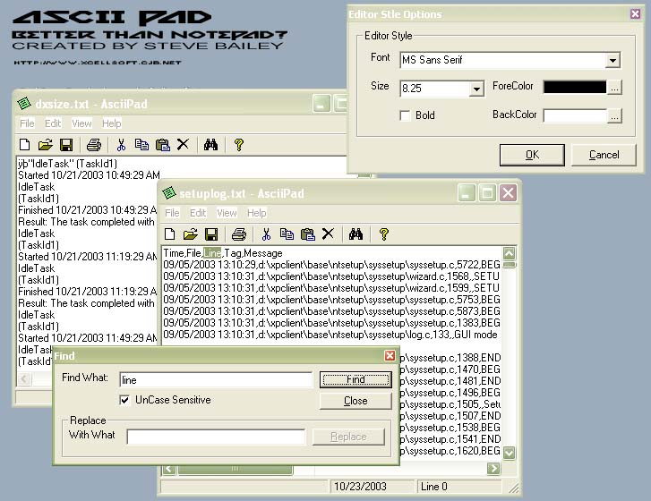



## AsciiPad

### Description

A crafty version of notepad with all the extra trimmings Microsoft left and none of the ones that brought it down! + customise it by changing the back/foreground colors, changing the editor font etc... (can associate .txt file to AsciiPad.exe when compiled, and they will open!)
 
### More Info
 

             |
---                |---
**Submitted On**   |2003-10-23 00:15:58
**By**             |[Aimee Bailey](https://github.com/Planet-Source-Code/PSCIndex/blob/master/ByAuthor/aimee-bailey.md)
**Level**          |Intermediate
**User Rating**    |4.7 (14 globes from 3 users)
**Compatibility**  |VB 6\.0
**Category**       |[Complete Applications](https://github.com/Planet-Source-Code/PSCIndex/blob/master/ByCategory/complete-applications__1-27.md)
**World**          |[Visual Basic](https://github.com/Planet-Source-Code/PSCIndex/blob/master/ByWorld/visual-basic.md)
**Archive File**   |[AsciiPad16625010232003\.zip](https://github.com/Planet-Source-Code/aimee-bailey-asciipad__1-49410/archive/master.zip)

